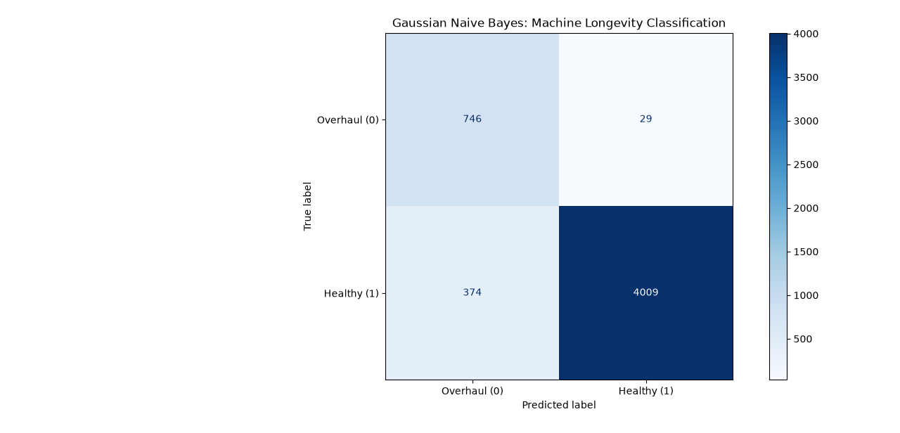

# Physics-Guided Turbomachinery Predictive Maintenance

An industrial prognostic model applying thermodynamic feature selection and Gaussian Naive Bayes classification to forecast high-speed turbomachinery degradation windows prior to operational trips.

---

## 1. Plant Operational Context
In continuous chemical process plants (ammonia, urea, methanol, refining), unspared turbomachinery trains—such as Synthesis Gas, Carbon Dioxide, and Process Air compressors—represent primary single-point uptime risks. 

Standard DCS instrumentation monitors instantaneous vibration, bearing metal temperatures, and lubrication parameters. However, gradual aerodynamic stage fouling, seal clearance degradation, and internal leakage drift thermodynamically for weeks before manifesting as mechanical vibration trips.

This project implements an early warning decision boundary targeting a **30-cycle proactive overhaul horizon** (RUL <= 30) using run-to-failure operational telemetry.

---

## 2. Dataset & Benchmark
The model is validated against the NASA Commercial Modular Aero-Propulsion System Simulation (C-MAPSS) **FD001** benchmark:
* **Operating Regime:** Sea-level continuous operation
* **Lifecycle Records:** 20,631 cycles across 100 engine units run to failure
* **Validation Records:** 5,158 unseen operational cycles
* **Channels:** 21 thermodynamic and mechanical sensor streams

---

## 3. Physics-Guided Feature Engineering
Rather than applying unconstrained dimensionality reduction (PCA or autoencoders), sensor selection is guided by the turbomachinery Brayton compression-expansion cycle:

1. **Pruning Flat Sensors:** 6 channels showed zero operational variance across all units and were eliminated (T2, P2, P15, epr, far, Nf_dnc).
2. **Tracking Thermodynamic Coupling:** 15 active features were retained. Degradation exhibits a coupled physical signature across stages:
   * **Exhaust Gas Temperature (T50):** Creeps up by +9.1 deg C as the governor increases fuel flow to compensate for stage work loss.
   * **HPC Discharge Temperature (T30):** Rises by +5.3 deg C due to polytropic efficiency reduction and internal heat build-up.
   * **Diffuser Backpressure (Ps30):** Increases by +0.35 kg/cm2 g from blade deposit fouling.
   * **Bleed Enthalpy (htBleed):** Increases by +1.4 kcal/kg from internal stage recirculation.

---

## 4. Modeling Strategy: Gaussian Naive Bayes
Predicting overhaul regimes in industrial time series presents severe class imbalance (healthy cycles outnumber degradation states > 5:1).

* **Probabilistic Formulation:** Computes class posteriors assuming conditional feature distributions:
  P(Y | X) proportional to P(Y) * Product(P(Xi | Y))
* **Linear Log-Odds Boundary:** While thermodynamic features share physical coupling, Naive Bayes forms a stable decision plane in log-odds space, providing natural regularization against sensor noise without overfitting.

---

## 5. Evaluation & Asymmetric Loss Matrix

Validation on **5,158 unseen operational test records**:

| Metric | Score | Operational Significance |
| :--- | :--- | :--- |
| **Overall Accuracy** | **92.2%** | High baseline discrimination across operational cycles |
| **Recall (Critical Class)** | **96.3%** | 746 of 775 imminent failure regimes captured (Type II error < 3.8%) |
| **Precision** | **66.6%** | 374 conservative inspection cushions (Type I error) |
| **True Negatives** | **4,009 runs** | Confirmed healthy baseline, minimizing unnecessary downtime |

### The Industrial Loss Matrix
In continuous process operations, the cost of a **False Negative** (an unpredicted trip causing flaring, thermal shock, and days of lost synthesis production) is orders of magnitude higher than a **False Positive** (scheduling an on-line performance audit or boroscope inspection). The model deliberately prioritizes high recall on the degradation horizon.

6. Repository Structure
README.md - Project documentation and engineering analysis

predictive_maintenance_gnb.py - Data pipeline, feature selection, and GNB model

requirements.txt - Environment dependencies

Figure_1.png - Confusion matrix visualization

image of machine.jpg - Machine cross-section schematic

7. Setup and Execution
Clone the repository:
git clone https://github.com/RamaRaghavaKotti/turbomachinery-predictive-maintenance.git

Navigate to project folder:
cd turbomachinery-predictive-maintenance

Install dependencies:
pip install -r requirements.txt

Run the training and evaluation pipeline:
python predictive_maintenance_gnb.py

